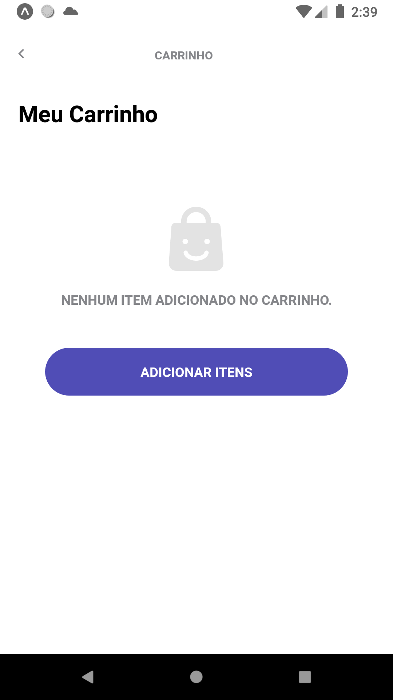

# Frontend Developer Clone - Gavea
    
Desenvolver um curto fluxo de checkout. Algumas destas tarefas envolvem integração com uma API pública.

# LAYOUT

Layout link: https://www.figma.com/file/0dLgrLvzADWbeonHST2CSD/React-Native---Palermo?node-id=0%3A1

HOME |  HOME
:-------------------------:|:-------------------------:
|
CART |  CONFIRMATION
|

## Requirements

- [x] Splash screen

- [x] Home screen

- [x] Cart screen

- [x] Confirmation screen

- [x] You must use styled-components

- [ ] use a state library 

- [ ] add category filter

- [ ] number of badge products

- [ ] add and remove items from cart

- [ ] create at least one automated test

- [x] Semantic Git commits

- [x] Light/Dark mode theme

- [x] Absoluty import

## Install Aplication


_To install Palermo, follow these steps_


Linux, macOS e Windows:


```
npm install
```
or
```
yarn install
```

## About Application Development

The developed application seeks to show all code maturity. Applying `clean code` techniques, making the most of the proposed activities, such as:

`javascript` / `styled-components` : for general application development;

`firebase` / `zustand` : for state management and data storage;

`teste-library` : for automated test execution;
